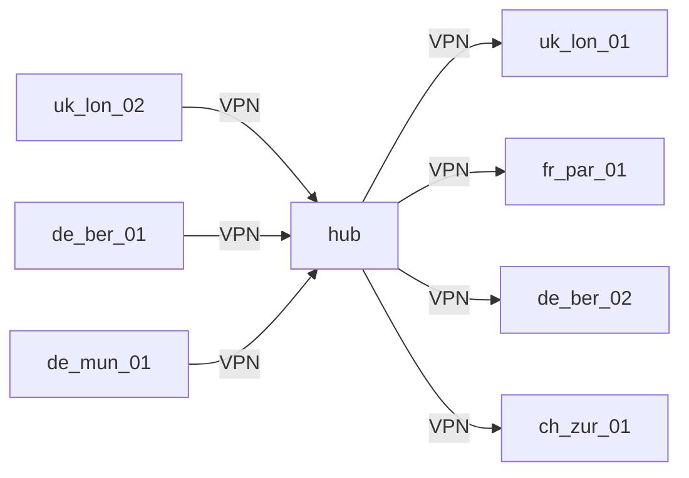

# Ubiquiti/Unifi CloudKey Bash Scripting to generate network, VPN, VTI and BGP config

Just a simple CSV file, and a series of template JSON files depending on the hub, or spoke viewpoint. Intended to save HOURS or even DAYS doing this by hand.

# Contributions
- Version:        1.0.0
- Creation Date:  2020-06-01
- Last Updated:   2024-03-13
- Author:         sjackson0109


## Overview

These scripts process data from a CSV file and utilize predefined JSON templates to generate configurations for the intended `hub and spokes` VPN architecture, respectively.
The output configurations are stored in the /root/generated folder.

## Purpose
generate-usg-hub.sh: This script is responsible for configuring the hub of the network. It reads data from the provided CSV file and generates network configurations tailored for the hub device. These configurations include settings such as IPsec tunnels, BGP neighbors, and other parameters necessary for network operation.

generate-usg-spokes.sh: This script focuses on configuring the spokes of the network. Similar to the hub script, it processes CSV data to generate individual network configurations for each spoke device. These configurations include specific settings for each spoke, such as local subnets, peer information, and BGP metrics.

## Benefits of Enterprise-Scale Network Design
Implementing an enterprise-scale network design offers several advantages, including:

- **Scalability**: The hub-and-spoke architecture provides scalability by allowing additional spokes to be easily added to the network as needed.
- **Centralized Management**: With a central hub, network management and monitoring can be centralized, simplifying administration tasks.
- **Redundancy**: The redundant nature of the hub-and-spoke design enhances network reliability by providing multiple paths for data transmission.
- **Security**: IPsec tunnels between the hub and spokes ensure secure communication over the network, enhancing data protection.

## Cons for using Ubiquity Hardware
THESE ARE MY OWN VIEWS
One major downside of using Ubiquiti hardware is limited support options compared to more traditional enterprise networking vendors. Ubiquiti's support infrastructure, while improving, may not offer the same level of responsiveness or expertise as established networking companies. This can be particularly challenging for organisations with complex network requirements or those in need of immediate assistance during critical issues.

Another downside is the occasional inconsistency in firmware updates and feature releases. Ubiquiti's development cycle may result in occasional delays or issues with firmware updates, leading to potential compatibility issues or bugs that could impact network performance or security. Additionally, certain advanced features or configurations commonly found in enterprise-grade networking equipment may be lacking or underdeveloped in Ubiquiti hardware, limiting its suitability for certain use cases.

## Preparing your CloudKey
To log in to SSH on your controller, follow these steps:
1. Open a terminal (mac/linux) or download putty for Windows
2. Either use the `ssh` command followed by the username and IP address of your controller. Eg:
    ```
    ssh root@unifi.company.local
    ```
3. Capture the password from the Controller's Site on the Unifi Controller admin console, in the `settings > advanced` area. Paste the password into the SSH window. 

    If it's your first time connecting to the controller, you may also see a message asking if you want to continue connecting with the public key off the controller. Type `yes` or `y` and press Enter to proceed.

4. Once authenticated, you will be logged in to your controller via SSH. You should now see a BASH command prompt, indicating that you have successfully connected. Looking like this:
    ```
    root@UNIFICONTROLLERXXX>
    ```

5. Download this repo to your current directory:
    ```
    wget https://github.com/sjackson0109/unifi-cloudkey-usg-hub-n-spoke/archive/main.zip
    ```
6. Extract the downloaded zip, to the current folder.
    ```
    unzip main.zip
    ```
7. Move the sub-folder into your root-users home-directory:
    ```
    sudo mv unifi-cloudkey-usg-hub-n-spoke-main /root
    ```
8. Ensure all the scripts can be executed using:
    ```
    chmod +x /root/scripts/*.sh
    ```

This project is ready to use.

## CSV Data File (wheel.csv)
The CSV file located at `/root/config/wheel.csv` contains network configuration data used by the scripts. This file needs `all-fields-double-quoted` with `comma delimiters`.

Below is a table representing a portion of the CSV data:
| local_site | local_octetid | local_subnets                 | local_asn | eth2_percent | eth3_percent | location | remote_site | remote_asn | tun0_peer                  | tun0_psk   | tun0_vti | tun0_bgp_weight | tun0_bgp_metric | tun1_peer                  | tun1_psk   | tun1_vti | tun1_bgp_weight | tun1_bgp_metric |
|------------|---------------|-------------------------------|-----------|--------------|--------------|----------|-------------|------------|----------------------------|------------|----------|-----------------|-----------------|----------------------------|------------|----------|-----------------|-----------------|
| uk-lon-01   | 101           | 10.101.0.0/16 172.16.0.0/20                 | 65101     | 99           | 1            | London   | hub         | 65100      | wan1.hub.company.com | REDACTED | vti0     | 200             | 200             | wan2.hub.company.com | REDACTED | vti1     | 300             | 300             |
| uk-lon-02   | 102           | 10.102.0.0/16                                | 65102     | 99           | 1            | London   | hub         | 65100      | wan1.hub.company.com | REDACTED | vti2     | 200             | 200             | wan2.hub.company.com | REDACTED | vti3     | 300             | 300             |
| fr-par-01   | 103           | 10.103.0.0/16                                | 65103     | 99           | 1            | Paris    | hub         | 65100      | wan1.hub.company.com | REDACTED | vti4     | 200             | 200             | wan2.hub.company.com | REDACTED | vti5     | 300             | 300             |
| de-ber-01   | 104           | 10.104.0.0/16                                | 65104     | 99           | 1            | Berlin   | hub         | 65100      | wan1.hub.company.com | REDACTED | vti6     | 200             | 200             | wan2.hub.company.com | REDACTED | vti7     | 300             | 300             |
| de-ber-02   | 105           | 10.105.0.0/16                                | 65105     | 99           | 1            | Berlin   | hub         | 65100      | wan1.hub.company.com | REDACTED | vti8     | 200             | 200             | wan2.hub.company.com | REDACTED | vti9     | 300             | 300             |
| de-mun-01   | 106           | 10.106.0.0/16                                | 65106     | 99           | 1            | Munich   | hub         | 65100      | wan1.hub.company.com | REDACTED | vti10    | 200             | 200             | wan2.hub.company.com | REDACTED | vti11    | 300             | 300             |
| ch-zur-01   | 107           | 10.107.0.0/16                                | 65107     | 99           | 1            | Zurich   | hub         | 65100      | wan1.hub.company.com | REDACTED | vti12    | 200             | 200             | wan2.hub.company.com | REDACTED | vti13    | 300             | 300             |

### Notes
- **local_octetid** is used for a virtual tunnel interface address, `169.254.{{ local_octetid }}.1` and `169.254.{{ local_octetid }}.5` in the middle of the wheel (hub) and `169.254.{{ local_octetid }}.2` and `169.254.{{ local_octetid }}.6` for the outsides of the wheel (spokes)

### Diagram
Drawing a radial diagram (after all we are talking about a wheel here) isn't easy with Mermaid.

Here is one I prepared with the `generate-diagram.sh` script, and the above CSV file:


## Usage / Instructions

1. **generate-usg-hub.sh** - Generates configuration files for the hub device. Execute using:
    ```
    /root/scripts/generate-usg-hub.sh 
    ```
    It will prompt you to input specific parameters such as the number of spokes and the hub IP address. After entering the required information, the script will generate the necessary configuration files.
2. **generate-usg-spokes.sh** - Generates configuration files for spoke devices. Execute using:
    ```
    /root/scripts/generate-usg-spokes.sh
    ```
    Similar to generate-usg-hub.sh, it will prompt you to input parameters such as the hub IP address and the number of spokes. After providing the required information, the script will generate the configuration files for the spoke devices.
3. **generate-diagram.sh** - Generates a Mermaid diagram from the wheel.csv file. Execute using:
    ```
    /root/scripts/generate-diagram.sh
    ```
    It will read the wheel.csv file, process the data, and generate a Mermaid diagram in Markdown format. The resulting diagram will be saved in the `/root/generated/diagram.md` file.


## Support or Warranty
These scripts are provided without warranty or guarantee of performance in a production environment. Review the generated config.gateway.json file against the live configuration to ensure only necessary configurations are transferred. Ubiquiti does not provide support for these scripts.

## Contributors
Contributions to improve the code, such as using functions and arguments to build specific configuration files, are welcome. JSON templates for the UXG series are also needed.

The provided Markdown document outlines the steps to prepare the CloudKey, use the scripts, and understand the purpose and benefits of the scripts. It also emphasizes the lack of warranty and support from Ubiquiti and encourages contributions from users to enhance the codebase.