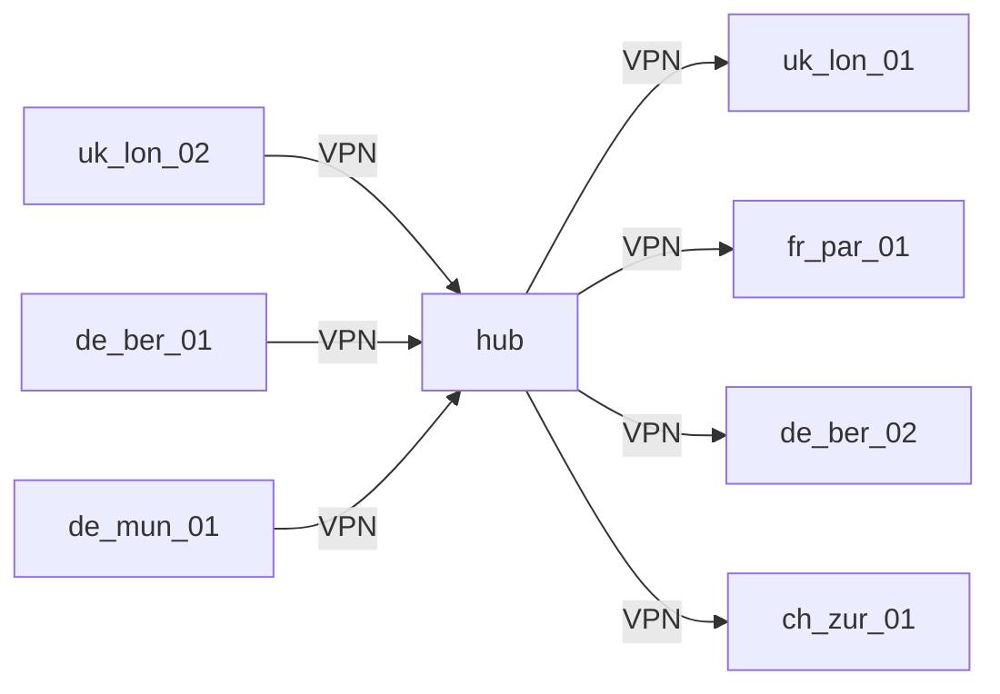
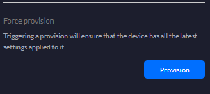

# Ubiquiti/Unifi CloudKey Bash Scripting to generate a hub-and-spoke network configuration.

Just a simple CSV file, and a series of template JSON files depending on the hub, or spoke viewpoint. Intended to save HOURS or even DAYS doing this by hand.

# Contributions
- Version:        1.0.1
- Creation Date:  2020-06-01
- Last Updated:   2024-03-13
- Author:         sjackson0109

## Brief

These scripts process data from a CSV file and utilize predefined JSON templates to generate configurations for the intended `hub and spokes` network architecture, including establishment of site-to-site `IPSec VPN`s (tunnel mode, not traffic mode/policy based), `virtual-tunnel-interfaces` and `BGP to deliver dynamic routing`.
The output configurations are stored in the ./generated folder.

## Purpose
We have two main build scripts. The first reads configuration data from the provided CSV file (`./config/wheel.csv`) and imports a series of JSON templates (`./templates/hub-*.json`) and substitutes variables inside the main template (`./templates/hub.json`). Then the CSV data is itterated over and values substituted into the merged template in memory. The script then outputs the intended configuration file (`./output/hub-SITENAME.json`).  Update the headers of the `generate-usg-hub` file to be sure company specific domain/FQDNs/support-address or syslog server, or custom cloudkey url are to be used.

The second script is almost identical, except the complex iterations are much smaller, as there are `only two vpn tunnels to configure for each of the spoke` sites; they loop over the main template (`./templates/spokes.json`) and import in a series of JSON templates (`./templates/spokes-*.json`), performing the same type of value substitution.

## Enterprise-Scale Network Design
Implementing an enterprise-scale network design (specifically the `hub and spoke` model) offers several key advantages, including:

- **Scalability**: The hub-and-spoke architecture provides scalability by allowing additional spokes to be easily added to the network as needed.
- **Centralised Management**: With a central hub, network management and monitoring can be centralized, simplifying administration tasks.
- **Redundancy**: The redundant nature of the hub-and-spoke design enhances network reliability by providing multiple paths for data transmission.
- **Security**: IPsec tunnels between the hub and spokes ensure secure communication over the network, enhancing data protection.


### Schematic/Diagram
Drawing a radial diagram (after all we are talking about a wheel here) isn't easy with Mermaid diagramming, yet.

I prepared this left/right split which renders for just a handful of sites quite nicely. Doesn't work so well for 20+ sites. You can generate this with the simple command  `./scripts/generate-diagram.sh` script (be-sure to follow the prep tasks below first), and the above CSV file:


## Cons for using Ubiquity Hardware
THESE ARE MY OWN VIEWS
One major downside of using Ubiquiti hardware is limited support options compared to more traditional enterprise networking vendors. Ubiquiti's support infrastructure, while improving, may not offer the same level of responsiveness or expertise as established networking companies. This can be particularly challenging for organisations with complex network requirements or those in need of immediate assistance during critical issues.

Another downside is the occasional inconsistency in firmware updates and feature releases. Ubiquiti's development cycle may result in occasional delays or issues with firmware updates, leading to potential compatibility issues or bugs that could impact network performance or security. Additionally, certain advanced features or configurations commonly found in enterprise-grade networking equipment may be lacking or underdeveloped in Ubiquiti hardware, limiting its suitability for certain use cases.

My own frustration stems with the Spoke Firewalls, with WAN Load Balancing configured. Despite the fact we bind the IPSEC tunnel to initiate from eth2 or eth3. Both tunnels establish with the hub, yet they both originate from eth2's public IP-address. This is because the interface eth3 uses the new routing-table. 
**If anyone knows of a solution to this, i would be very interested in excluding IPSEC traffic from the WAN Load Balancing group**

## Preparing your CloudKey
To log in to SSH on your controller, follow these steps:
1. Open a terminal (mac/linux) or download putty for Windows
2. Either use the `ssh` command followed by the username and IP address of your controller. Eg:
    ```
    ssh root@unifi.company.local
    ```
3. Capture the password from the Controller's Site on the Unifi Controller admin console, in the `settings > advanced` area. Paste the password into the SSH window. 

    If it's your first time connecting to the controller, you may also see a message asking if you want to continue connecting with the public key off the controller. Type `yes` or `y` and press Enter to proceed.

4. Once authenticated, you will be logged in to your controller via SSH. You should now see a BASH command prompt, indicating that you have successfully connected. Looking like this:
    ```
    root@UNIFICONTROLLERXXX>
    ```

5. Download this repo to your current directory:
    ```
    wget https://github.com/sjackson0109/unifi-cloudkey-usg-hub-n-spoke/archive/main.zip
    ```
6. Extract the downloaded zip, to the current folder.
    ```
    unzip main.zip
    ```
7. Move the sub-folder into your root-users home-directory:
    ```
    sudo mv unifi-cloudkey-usg-hub-n-spoke-main .
    ```
8. Ensure all the scripts can be executed using:
    ```
    chmod +x ./scripts/*.sh
    ```

This project is ready to use.

## Configuration File
The CSV file located at [`./config/wheel.csv`](./config/wheel.csv) contains network configuration data used by the scripts. This file needs `all-fields-double-quoted` with `comma delimiters`.

Below is a table representing a portion of the CSV data:
| local_site | local_octetid | local_subnets                 | local_asn | eth2_percent | eth3_percent | location | remote_site | remote_asn | tun0_peer                  | tun0_psk   | tun0_vti | tun0_bgp_weight | tun0_bgp_metric | tun1_peer                  | tun1_psk   | tun1_vti | tun1_bgp_weight | tun1_bgp_metric |
|------------|---------------|-------------------------------|-----------|--------------|--------------|----------|-------------|------------|----------------------------|------------|----------|-----------------|-----------------|----------------------------|------------|----------|-----------------|-----------------|
| uk-lon-01   | 101           | 10.101.0.0/16 172.16.0.0/20                 | 65101     | 99           | 1            | London   | hub         | 65100      | wan1.hub.company.com | REDACTED | vti0     | 200             | 200             | wan2.hub.company.com | REDACTED | vti1     | 300             | 300             |
| uk-lon-02   | 102           | 10.102.0.0/16                                | 65102     | 99           | 1            | London   | hub         | 65100      | wan1.hub.company.com | REDACTED | vti2     | 200             | 200             | wan2.hub.company.com | REDACTED | vti3     | 300             | 300             |
| fr-par-01   | 103           | 10.103.0.0/16                                | 65103     | 99           | 1            | Paris    | hub         | 65100      | wan1.hub.company.com | REDACTED | vti4     | 200             | 200             | wan2.hub.company.com | REDACTED | vti5     | 300             | 300             |
| de-ber-01   | 104           | 10.104.0.0/16                                | 65104     | 99           | 1            | Berlin   | hub         | 65100      | wan1.hub.company.com | REDACTED | vti6     | 200             | 200             | wan2.hub.company.com | REDACTED | vti7     | 300             | 300             |
| de-ber-02   | 105           | 10.105.0.0/16                                | 65105     | 99           | 1            | Berlin   | hub         | 65100      | wan1.hub.company.com | REDACTED | vti8     | 200             | 200             | wan2.hub.company.com | REDACTED | vti9     | 300             | 300             |
| de-mun-01   | 106           | 10.106.0.0/16                                | 65106     | 99           | 1            | Munich   | hub         | 65100      | wan1.hub.company.com | REDACTED | vti10    | 200             | 200             | wan2.hub.company.com | REDACTED | vti11    | 300             | 300             |
| ch-zur-01   | 107           | 10.107.0.0/16                                | 65107     | 99           | 1            | Zurich   | hub         | 65100      | wan1.hub.company.com | REDACTED | vti12    | 200             | 200             | wan2.hub.company.com | REDACTED | vti13    | 300             | 300             |

### Notes
- **all cells** need to be double-quote encapsulated. See the sample CSV provided [`./config/wheel.csv`](./config/wheel.csv).
- **local_octetid** is used for a virtual tunnel interface address, `169.254.{{ local_octetid }}.1` and `169.254.{{ local_octetid }}.5` in the middle of the wheel (hub) and `169.254.{{ local_octetid }}.2` and `169.254.{{ local_octetid }}.6` for the outsides of the wheel (spokes)
- **local_subnets** can support a list of subnets, which needs to be `space` separated, not comma-separated. For example: `"10.10.101.0/24 10.10.102.0/24 172.17.2.0/26"`

## How to use
Make sure you spend a bit of time with the CSV (spreadsheet) getting your design right. Perhaps you already have one you wish to use, or need to take an initial design and just improve on it to suit your site-to-site needs. Your wheel.csv is the first starting point.

Secondly, once you uploaded wheel.csv into the ./config directory, you need to use the following scripts to prepare your `config.gateway.json` files. Note they are not actually all called the same thing, otherwise that would be very confusing.

- **generate-usg-hub.sh** - Generates configuration files for the hub device. Execute using:
    ```
    ./scripts/generate-usg-hub.sh 
    ```
    It will prompt you to input specific parameters such as the number of spokes and the hub IP address. After entering the required information, the script will generate the necessary configuration files.
- **generate-usg-spokes.sh** - Generates configuration files for spoke devices. Execute using:
    ```
    ./scripts/generate-usg-spokes.sh
    ```
    Similar to generate-usg-hub.sh, it will prompt you to input parameters such as the hub IP address and the number of spokes. After providing the required information, the script will generate the configuration files for the spoke devices.
- **generate-diagram.sh** - Generates a Mermaid diagram from the wheel.csv file. Execute using:
    ```
    ./scripts/generate-diagram.sh
    ```
    It will read the wheel.csv file, process the data, and generate a Mermaid diagram in Markdown format. The resulting diagram will be saved in the `./generated/diagram.md` file.

## Symbolic Links (optional)
If you have worked with manipulating config.gateway.json files in the past, forget the folder-path depends entirely on the short/random site-id value.. it's easy to make a mistake and deploy to the wrong site.

I created some symbolic links (`ln -s ./links/sitename /path`) that look like this:
```
root@CLOUDKEY:~# ls -l ./links
total 0
lrwxrwxrwx 1 root root 28 Feb  6 17:26 uk-lon-01 -> /data/unifi/data/sites/default/
lrwxrwxrwx 1 root root 28 Feb  6 17:26 uk-lon-02 -> /data/unifi/data/sites/rhuthx8n/
lrwxrwxrwx 1 root root 28 Feb  6 17:26 hub -> /data/unifi/data/sites/y80ho7an/
lrwxrwxrwx 1 root root 28 Feb  6 17:26 fr-par01 -> /data/unifi/data/sites/6dho444u/
lrwxrwxrwx 1 root root 28 Feb  6 17:26 de-ber-01 -> /data/unifi/data/sites/y599xXc8/
lrwxrwxrwx 1 root root 28 Feb  6 17:27 de-ber-02 -> /data/unifi/data/sites/awivGr8v/
lrwxrwxrwx 1 root root 28 Feb  6 17:27 de-min-01 -> /data/unifi/data/sites/l32s9d03/
lrwxrwxrwx 1 root root 28 Feb  6 17:27 ch-zur-01 -> /data/unifi/data/sites/e1lfeewy/
```

## Are there any risks?
Quite frankly, Yes. If you don't know what you are doing with Ubiquiti devices, or have never really (manually) built IPSEC VPNs, or even had the joy of working with BGP. Then you are not experienced or qualified to be working with this. Your business could cripple to a halt, if you get the design wrong.  Words of advice: take baby steps.

If your config file isn't properly understood (or accepted) by the remote firewall, it will simply reject the provisioned changes and roll back to the previous working one. If there wasn't one (new firewall, or never used a config.gateway.json file before), then it will roll back to the starter file (pretty much empty config, from factory reset). 

Made any configuration changes to the SITE or FIREWALL using the CloudKey?
If you configured them via the GUI (networks/subnets/vlans, or even VPNs, and firewall rules etc), they will all remain after this change.

If you configured any of them via config.gateway.json file, they will be lost! You need time and adequate planning to get this right. The generated files are a working-sample, not a production-approved copy of the config. to get to a production-approved copy, follow the rules of change control, peer-reviews, testing in isolation, perform your own evaluation on the risks etc.
`I'm not accepting responsibility if you mess up this config because you didn't adhere to change control.`

Note: You can always manually copy sections across from your old config.gateway.json into the new spoke-sitename.json, to mitigate any risks, before proceeding. Make sure it's a valid JSON before you use it.
Tip: You can always validate a JSON file using: `cat filename.json | jq --validate`, if you get an error like `parse error: Invalid numeric literal at line 40, column 3`, then go to that line, and make sure it's got properly terminated brackets/braces, and each element in the json is comma separated.

## Ready to deploy?
First, **follow change control** before you proceed. Ensure you meet the branch-site's agreed/communicated schedule.

STEPS:
- Copy out the relevant firewall config:
  ```
  root@CLOUDKEY:~# cat ./output/spoke-uk-lon-01.json >> ./links/uk-lon-01/config.gateway.json
  ```
  Note: I suggest you update the HUB firewall first, before any of the spokes.

- Provisioning step:
  Push the provision button on the target firewall:

  ]

  When prompted to `Are you sure you want to force provision <FIREWALLNAME>?` don't forget to press `confirm`.

- Wait 2-3 minutes

- Login to the HUB Firewall via SSH, and check the status of the tunnels.
  ```
  ssh root@ip.of.cloudkey.controller  # > login
  root@CLOUDKEY:~# ipsec statusall
  Security Associations (0 up, 1 connecting):
  b02e_1aa8_58a8_a9ad[1]: CONNECTED, {HUB WAN IPa}[%any]...{SPOKE 1 WAN IPa}[%any]
  c42e_1sw2_f8ff_ua98[1]: CONNECTED, {HUB WAN IPb}[%any]...{SPOKE 1 WAN IPb}[%any]
  d7f1_b88c_4bd9_1a3e[1]: CONNECTED, {HUB WAN IPa}[%any]...{SPOKE 2 WAN IPa}[%any]
  e3a6_9c2d_7f5b_e1c7[1]: CONNECTED, {HUB WAN IPb}[%any]...{SPOKE 2 WAN IPb}[%any]
  f8b9_3e4a_2d1c_6b5f[1]: CONNECTED, {HUB WAN IPa}[%any]...{SPOKE 3 WAN IPa}[%any]
  6d7c_a2b1_9e8f_c3d4[1]: CONNECTING, {HUB WAN IPb}[%any]...{SPOKE 3 WAN IPb}[%any]    <-- THERE IS AN ISSUE HERE
  a1f4_5e6d_8c7b_b9a8[1]: CONNECTED, {HUB WAN IPa}[%any]...{SPOKE 4 WAN IPa}[%any]
  b5c8_d4e7_3f2a_1b9e[1]: CONNECTED, {HUB WAN IPb}[%any]...{SPOKE 4 WAN IPb}[%any]
  root@CLOUDKEY:~# 
  ```
  In my example above, spoke 3 says `connecting`, this is because the secondary WAN circuit on Spoke #3 was offline at the time. Troubleshooting why your tunnels are not UP (or `connected`); sorry to say, is out of scope of this project, and is situation specific. Check for typos in the CSV, check for commas where there should be full-stops, check that subnets don't get re-used (bgp will have problems)
  
  Suggest you search around on [https://community.ui.com](https://community.ui.com) for troubleshooting assistance/tips/help/guides. 

- Check BGP
  ```
  ssh ubnt@ip.of.cloudkey.controller  # > login
  ubnt@CLOUDKEY:~# show ip bgp summary
  admin@bgp3:~$ show ip bgp summary
  BGP router identifier x.x.x.x, local AS number myas
  BGP table version is 8982568
  143970 BGP AS-PATH entries
  4689 BGP community entries
  Neighbor                 V  AS       MsgRcv    MsgSen  TblVer   InQ   OutQ    Up/Down   State/PfxRcd
  169.253.101.2            4  65101    791087    1058117 8982559  0      0     1d08h51m         290719
  169.253.101.6            4  65101	 9287      8282    8982497  0      0     1d08h52m              4
  169.253.102.2            4  65102	 1252789   8293    8982536  0      0     1d08h52m         109673
  169.253.102.6            4  65102	 1159392   8293    8982469  0      0     1d08h52m         108007
  169.253.103.2            4  65103	 9274      8282    8982559  0      0     1d08h52m              4
  169.253.103.6            4  65103	 620       22      0        0      0     never              Idle
  ```
  Again in my example above, the peer `169.254.103.6` is not connected, we are idle.

  You can troubleshoot the advertised or received routes using these commands:
  ```
  show ip bgp neighbors 169.253.101.2 advertised-routes
  show ip bgp neighbors 169.253.101.2 received-routes
  ```

  If you don't know BGP, or need further help, sorry but i suggest you search around on this article [https://help.ui.com/hc/en-us/articles/205222990-EdgeRouter-Border-Gateway-Protocol-BGP](https://help.ui.com/hc/en-us/articles/205222990-EdgeRouter-Border-Gateway-Protocol-BGP) for assistance in configuring BGP.

## Whats next?
You will likely now want to address firewall objects, rules etc. Maybe get some traffic flowing.

## Support or Warranty
These scripts are provided without warranty or guarantee of performance in a production environment. Review the generated `config.gateway.json` file against the live configuration to ensure only necessary configurations are transferred. Ubiquiti does not provide support for these scripts.

### Issues and Feedback
If you encounter any issues or have feedback to improve these scripts, please log them in the [GitHub Issues](https://github.com/sjackson0109/unifi-cloudkey-usg-hub-n-spoke/issues) or [Discussions](https://github.com/sjackson0109/unifi-cloudkey-usg-hub-n-spoke/discussions) section of this repository. Your input is valuable and helps in enhancing the usability and reliability of the scripts for the community.

## Contributors
Contributions to improve the code, such as using functions and arguments to build specific configuration files, are welcome. JSON templates for the UXG series are also needed.

The provided Markdown document outlines the steps to prepare the CloudKey, use the scripts, and understand the purpose and benefits of the scripts. It also emphasizes the lack of warranty and support from Ubiquiti and encourages contributions from users to enhance the codebase.