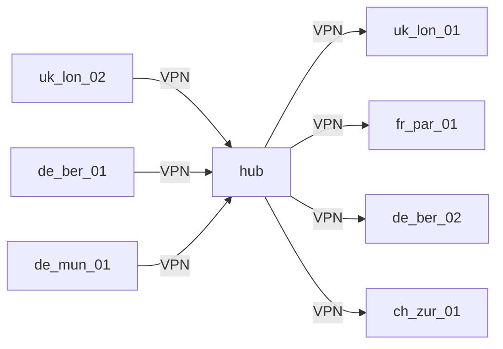

:::mermaid
flowchart LR

    subgraph HUB["HUB"]
        hub_wan["wan1.hub.company.com"]
        subgraph A["FIREWALL"]
            remote_site["HUB-FW-01"]
        end
    end

    subgraph SPOKE["SPOKE"]
        subgraph B["FIREWALL"]
            local_site["local_site"]
        end
        remote_wan["DHCP"]
    end

    remote_site === hub_wan
    remote_wan === local_site

    hub_wan -.- vpn.tun0 -.- remote_wan
    hub_wan -.- vpn.tun1 -.- remote_wan
    
:::